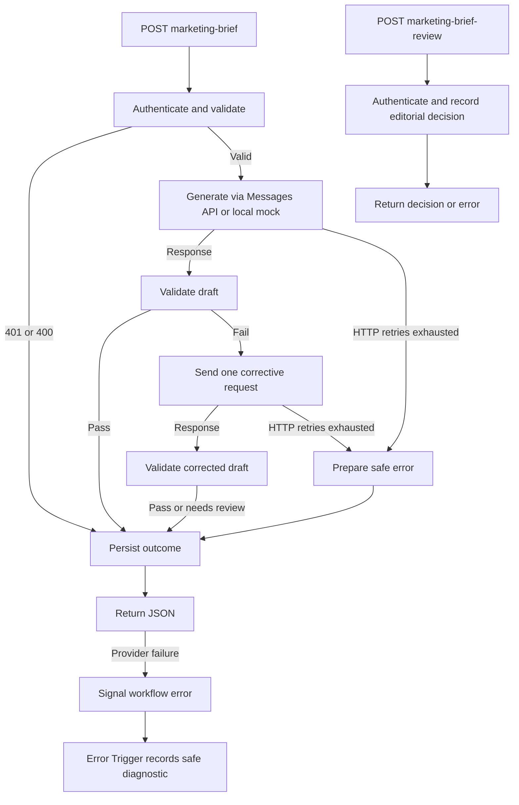

# Workflow diagram

```mermaid
flowchart TD
    A[POST marketing-brief] --> B[Authenticate and validate]
    B -->|401 or 400| S[Persist outcome]
    B -->|Valid| C[Generate via Messages API or local mock]
    C -->|Response| D[Validate draft]
    D -->|Pass| S
    D -->|Fail| E[Send one corrective request]
    E -->|Response| F[Validate corrected draft]
    F -->|Pass or needs review| S
    C -->|HTTP retries exhausted| G[Prepare safe error]
    E -->|HTTP retries exhausted| G
    G --> S
    S --> H[Return JSON]
    H -->|Provider failure| X[Signal workflow error]
    X --> Y[Error Trigger records safe diagnostic]
    J[POST marketing-brief-review] --> K[Authenticate and record editorial decision]
    K --> L[Return decision or error]
```
